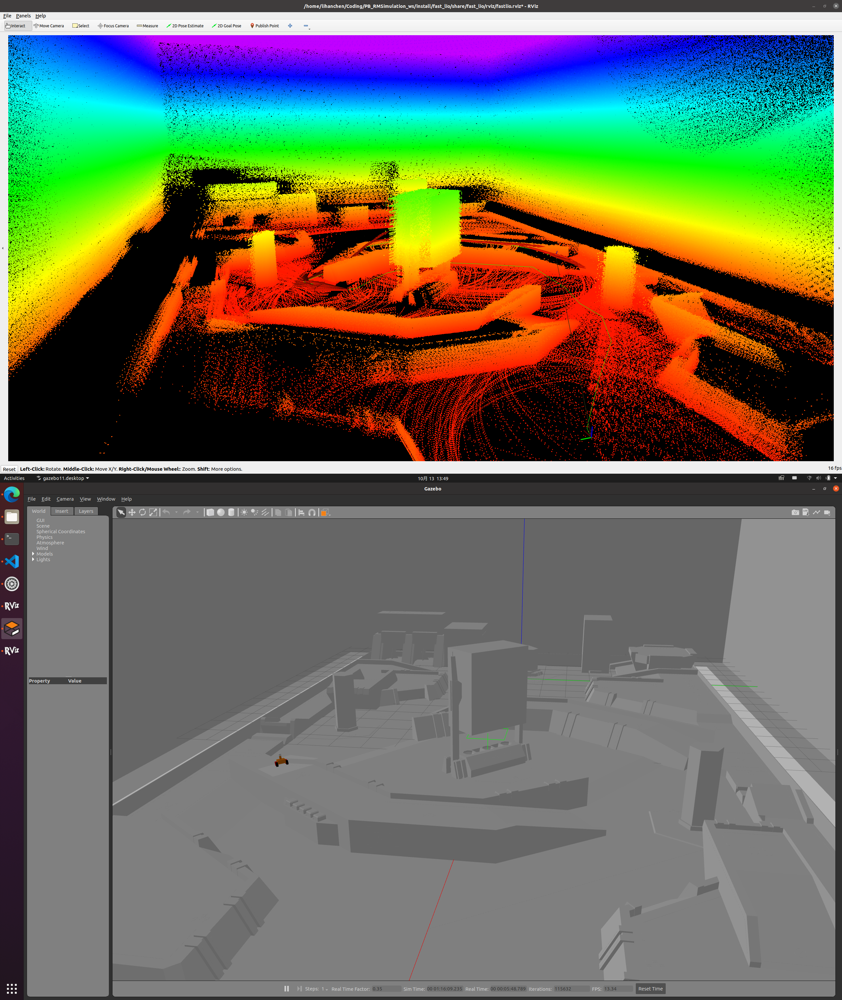

# PB_RM_Simulation
## 1. 项目介绍
本项目使用麦克纳姆轮仿真小车，附加 Livox mid360 雷达与 IMU，在 RMUC 地图进行导航仿真。支持 [FAST_LIO](https://github.com/Ericsii/FAST_LIO) 算法仿真

仿真小车基于基于 [华农 2023 RMUL 哨兵导航开源包](https://github.com/SCAU-RM-NAV/rm2023_auto_sentry_ws) 的 simple_meca_car 修改，将其升级为 ROS2 仿真包

mid360 点云仿真参考了 [livox_laser_simulation](https://github.com/Livox-SDK/livox_laser_simulation/blob/main/src/livox_points_plugin.cpp)、 [livox_laser_simulation_RO2](https://github.com/stm32f303ret6/livox_laser_simulation_RO2/blob/main/src/livox_points_plugin.cpp)、 [Issue15: CustomMsg](https://github.com/Livox-SDK/livox_laser_simulation/issues/15)

非常非常感谢以上开源项目的帮助！！！

<!--  -->



> Tips: 本项目中 Livox 雷达仿真发布两种话题， </br>
`livox_ros_driver2/msg/CustomMsg`, `sensor_msgs/msg/PointCloud2`

## 2. 环境搭建
当前开发分支为 ROS2 humble, Gazebo 11.10.0

```
sudo apt-get install ros-humble-gazebo-*
sudo apt-get install ros-humble-xacro
sudo apt-get install ros-humble-robot-state-publisher
sudo apt-get install ros-humble-joint-state-publisher
sudo apt-get install ros-humble-rviz
sudo apt install ros-humble-pcl-ros
sudo apt-get install libboost-all-dev
```

```
git clone https://gitee.com/SMBU-POLARBEAR/pb_rmsimulation -b humble
```

后续编译与运行过程中如果有依赖功能包未安装，按类似的方法安装。

## 3. 编译与运行

```
colcon build --symlink-install
```

请注意，编译本项目前，需要先 source livox_ros_driver2 软件包的工作空间，详见 [FAST_LIO](https://github.com/Ericsii/FAST_LIO#13-livox_ros_driver2) 的编译教程

a. 启动仿真
```
source install/setup.bash
ros2 launch pb_rm_simulation race.launch.py
```


b. FAST_LIO (搬运自 [Ericsii/FAST_LIO](https://github.com/Ericsii/FAST_LIO) )
```
source install/setup.bash
ros2 launch fast_lio mapping.launch.py
```

c. 键盘控制（搬运自 [turtlebot3](https://github.com/ROBOTIS-GIT/turtlebot3/tree/humble-devel/turtlebot3_teleop) ）
```
source install/setup.bash
export TURTLEBOT3_MODEL=burger
ros2 run turtlebot3_teleop teleop_keyboard
```

## 4. 地图选择
| 地图                    | 描述         | 来源  |
|:---------------------:|:----------:|:---:|
| rmuc.world            | 2022 7V7 地图 | [华农](https://github.com/SCAU-RM-NAV/rm2023_auto_sentry_ws)  |
| auto_world.world      | RMUA 自动赛地图  | [华农](https://github.com/SCAU-RM-NAV/rm2022_auto_infantry_ws)  |
| hbut_rmuc_world.world | 2023 7V7 地图 | [湖工大](https://github.com/HBUTHUANGPX/Hbut_LC_sentry) |
| RMUC2023_world | 2023 7V7 地图 | [Robomaster 官方](https://bbs.robomaster.com/thread-22576-1-1.html) |

当前默认地图为 RMUC2023_world </br>
注：在原有基础上增加了重力、摩擦力、材质颜色和室内灯光


如需更换地图，在 [race.launch.py](/pb_rm_simulation/launch/race.launch.py) 中配置地图路径即可，也可以通过命令行指定地图路径

```python
    declare_world_cmd = DeclareLaunchArgument(
        'world',
        default_value=os.path.join(bringup_dir, 'world', 'RMUC2023_world', 'RMUC2023_world.world'),
        description='Full path to world model file to load'
    )
```
## 5. 雷达选择
目前支持 livox 系列部分雷达: 
avia, HAP, horizon, mid40, mid70, mid360, tele 雷达。

感谢开源项目 [livox_laser_simulation_RO2](https://github.com/stm32f303ret6/livox_laser_simulation_RO2)

当前默认使用 mid360 仿真，如需更换雷达仿真，请在 [waking_robot.xacro](/pb_rm_simulation/urdf/waking_robot.xacro) 中仿照下述样式修改

```xml
  <!-- mid70 Laser -->
    <xacro:include filename="$(find ros2_livox_simulation)/urdf/mid70.xacro" />
    <xacro:mid70 name="livox" parent="base_link" topic="mid70">
        <origin xyz="0.0 0.0 0.225" rpy="0 0 0"/>
    </xacro:mid70>
```

## 6. TODO
1. ~~将湖工大地图模型文件修改为动态路径~~（2023.9.30 完成）

2. ~~多线雷达~~（2023.10.8 完成）

3. ~~适配为 ROS2 Humble 版本~~ (2023.10.13 完成)

4. 适配基础的 Cartograph 功能包，做到拿来就用

5. 优化键盘控制器

6. 根据不同地图适配小车出生点

7. 优雅的选择地图